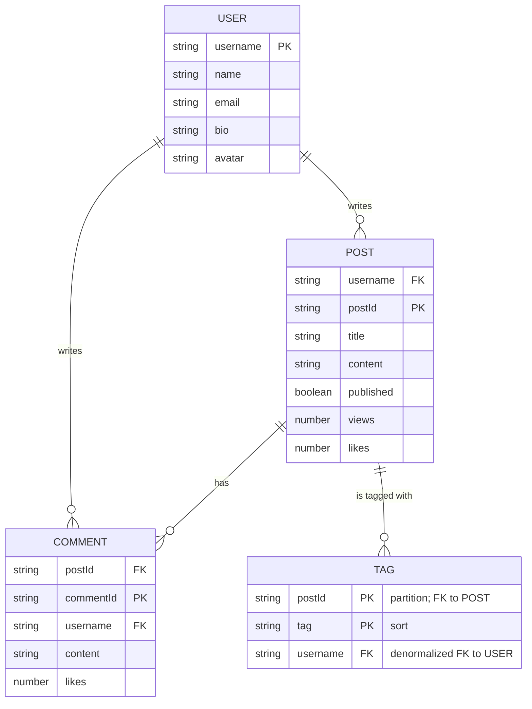

# Blog System

A complete example of building a blog system with users, posts, comments, and tags using Dynatable.

## Entity-Relationship Diagram (ER)

> Logical model. Physical partition/sort keys (e.g. `USER#${username}`, `POST#${postId}`) live in the **Key Structure** table below.



`TAG` is the join entity that materializes the N:M `Post ↔ tag` relationship: `postId` is the partition (FK to `POST`) and `tag` is the sort key. Its GSI1 swaps the two columns so you can query both "tags for a post" (primary index) and "posts for a tag" (GSI1).

`POST` reuses the same GSI for a second access pattern — listing all published posts chronologically — by partitioning on `published` and sorting by the ULID `postId`.

## Single Table Design

### Key Structure

| Entity Type | PK                  | SK                      | GSI1PK            | GSI1SK                          |
| ----------- | ------------------- | ----------------------- | ----------------- | ------------------------------- |
| User        | `USER#{username}`   | `USER#{username}`       | -                 | -                               |
| Post        | `USER#{username}`   | `POST#{postId}`         | `POSTS#{published}` | `POST#{postId}`               |
| Comment     | `POST#{postId}`     | `COMMENT#{commentId}`   | `USER#{username}` | `COMMENT#{commentId}`           |
| Tag         | `POST#{postId}`     | `TAG#{tag}`             | `TAG#{tag}`       | `POST#{postId}`                 |

The GSI in this example is named `gsi1`, with column names `GSI1PK` and `GSI1SK`.

### Access Patterns

1. **User**
   - Get user by username: `GetItem` with PK=`USER#{username}`, SK=`USER#{username}`
   - Create unique user: `PutItem` with `attribute_not_exists` condition

2. **Posts**
   - Create post: `PutItem` with PK=`USER#{username}`, SK=`POST#{postId}`
   - Get post: `GetItem` with PK=`USER#{username}`, SK=`POST#{postId}`
   - List user posts: `Query` with PK=`USER#{username}`, SK `begins_with` "POST#"
   - List published posts (chronological): Query gsi1 with GSI1PK=`POSTS#true` (postId is a ULID, so the SK sorts by creation time)

3. **Comments**
   - Add comment: `PutItem` with PK=`POST#{postId}`, SK=`COMMENT#{commentId}`
   - List comments on a post: `Query` with PK=`POST#{postId}`, SK `begins_with` "COMMENT#"
   - List comments by user: Query gsi1 with GSI1PK=`USER#{username}`, GSI1SK `begins_with` "COMMENT#"

4. **Tags**
   - Tag a post: `PutItem` with PK=`POST#{postId}`, SK=`TAG#{tag}`
   - List tags for a post: `Query` with PK=`POST#{postId}`, SK `begins_with` "TAG#"
   - List posts for a tag: Query gsi1 with GSI1PK=`TAG#{tag}`, then `BatchGetItem` for post details

## Schema Design

GSI key templates live on each model's `index:` field, not inside `attributes:`.

```typescript
export const BlogSchema = {
  format: 'dynatable:1.0.0',
  version: '1.0.0',

  indexes: {
    primary: {
      hash: 'PK',
      sort: 'SK',
    },
    gsi1: {
      hash: 'GSI1PK',
      sort: 'GSI1SK',
    },
  },

  models: {
    User: {
      key: {
        PK: { type: String, value: 'USER#${username}' },
        SK: { type: String, value: 'USER#${username}' },
      },
      attributes: {
        username: { type: String, required: true },
        name: { type: String, required: true },
        email: { type: String, required: true },
        bio: { type: String },
        avatar: { type: String },
      },
    },

    Post: {
      key: {
        PK: { type: String, value: 'USER#${username}' },
        SK: { type: String, value: 'POST#${postId}' },
      },
      index: {
        // GSI partitions posts by `published`, sorted by ULID postId (chronological)
        GSI1PK: { type: String, value: 'POSTS#${published}' },
        GSI1SK: { type: String, value: 'POST#${postId}' },
      },
      attributes: {
        username: { type: String, required: true },
        postId: { type: String, generate: 'ulid' },
        title: { type: String, required: true },
        content: { type: String, required: true },
        published: { type: Boolean, default: false },
        views: { type: Number, default: 0 },
        likes: { type: Number, default: 0 },
      },
    },

    Comment: {
      key: {
        PK: { type: String, value: 'POST#${postId}' },
        SK: { type: String, value: 'COMMENT#${commentId}' },
      },
      index: {
        // GSI for querying comments by user
        GSI1PK: { type: String, value: 'USER#${username}' },
        GSI1SK: { type: String, value: 'COMMENT#${commentId}' },
      },
      attributes: {
        postId: { type: String, required: true },
        commentId: { type: String, generate: 'ulid' },
        username: { type: String, required: true },
        content: { type: String, required: true },
        likes: { type: Number, default: 0 },
      },
    },

    Tag: {
      key: {
        PK: { type: String, value: 'POST#${postId}' },
        SK: { type: String, value: 'TAG#${tag}' },
      },
      index: {
        // GSI for reverse lookup (tag → posts)
        GSI1PK: { type: String, value: 'TAG#${tag}' },
        GSI1SK: { type: String, value: 'POST#${postId}' },
      },
      attributes: {
        postId: { type: String, required: true },
        tag: { type: String, required: true },
        // Denormalized so getPostsByTag can BatchGet posts (Post needs username + postId)
        username: { type: String, required: true },
      },
    },
  },

  params: {
    timestamps: true,
  },
} as const;
```

## Table Setup

```typescript
import { Table } from '@ftschopp/dynatable-core';
import { DynamoDBClient } from '@aws-sdk/client-dynamodb';
import { BlogSchema } from './schema';

export const table = new Table({
  name: 'BlogTable',
  client: new DynamoDBClient({ region: 'us-east-1' }),
  schema: BlogSchema,
});
```

## User Operations

### Create User

```typescript
async function createUser(username: string, name: string, email: string) {
  return await table.entities.User.put({
    username,
    name,
    email,
  })
    .ifNotExists()
    .execute();
}

// Usage
await createUser('alice', 'Alice Smith', 'alice@example.com');
```

### Get User Profile

```typescript
async function getUserProfile(username: string) {
  return await table.entities.User.get({
    username,
  }).execute();
}

// Usage
const user = await getUserProfile('alice');
console.log(user?.name, user?.bio); // user is User | undefined
```

### Update User Profile

```typescript
async function updateUserProfile(
  username: string,
  updates: { name?: string; bio?: string; avatar?: string }
) {
  return await table.entities.User.update({ username })
    .set(updates)
    .returning('ALL_NEW')
    .execute();
}

// Usage
await updateUserProfile('alice', {
  bio: 'Senior software engineer and tech blogger',
  avatar: 'https://example.com/avatar.jpg',
});
```

## Post Operations

### Create Post

```typescript
async function createPost(
  username: string,
  title: string,
  content: string,
  published: boolean = false
) {
  return await table.entities.Post.put({
    username,
    title,
    content,
    published,
  }).execute();
}

// Usage
const post = await createPost(
  'alice',
  'Getting Started with DynamoDB',
  'DynamoDB is a powerful NoSQL database...',
  true
);

console.log(post.postId); // Auto-generated ULID
```

### Get Post

```typescript
async function getPost(username: string, postId: string) {
  return await table.entities.Post.get({
    username,
    postId,
  }).execute();
}
```

### Get All Posts by User

```typescript
async function getUserPosts(username: string, limit: number = 20) {
  return await table.entities.Post.query()
    .where((attr, op) => op.eq(attr.username, username))
    .limit(limit)
    .scanIndexForward(false) // Newest first
    .execute();
}

// Usage
const posts = await getUserPosts('alice', 10);
posts.forEach((post) => {
  console.log(post.title, post.createdAt);
});
```

### Get All Published Posts

:::caution
The GSI partition is `POSTS#true` for every published post, so all reads land in a single partition. Fine for an example or a low-write blog — for a high-traffic feed, shard the partition (e.g. `POSTS#true#${shard}`) or denormalize a "feed" item collection.
:::

```typescript
async function getPublishedPosts(limit: number = 50) {
  return await table.entities.Post.query()
    .where((attr, op) => op.eq(attr.published, true))
    .useIndex('gsi1')
    .limit(limit)
    .scanIndexForward(false) // Newest first (ULID postId)
    .execute();
}

// Usage
const publishedPosts = await getPublishedPosts(20);
```

### Update Post

```typescript
async function updatePost(
  username: string,
  postId: string,
  updates: { title?: string; content?: string; published?: boolean }
) {
  return await table.entities.Post.update({ username, postId })
    .set(updates)
    .returning('ALL_NEW')
    .execute();
}
```

### Increment Post Views

```typescript
async function incrementPostViews(username: string, postId: string) {
  return await table.entities.Post.update({
    username,
    postId,
  })
    .add('views', 1)
    .execute();
}
```

### Like Post

```typescript
async function likePost(username: string, postId: string) {
  return await table.entities.Post.update({
    username,
    postId,
  })
    .add('likes', 1)
    .execute();
}
```

### Delete Post

```typescript
async function deletePost(username: string, postId: string) {
  // Note: comments and tags live under different partition keys
  // (`POST#${postId}`). To clean them up, query each related model
  // and delete the items in a transaction or batch as appropriate.
  return await table.entities.Post.delete({
    username,
    postId,
  }).execute();
}
```

## Comment Operations

### Add Comment

```typescript
async function addComment(postId: string, username: string, content: string) {
  return await table.entities.Comment.put({
    postId,
    username,
    content,
  }).execute();
}

// Usage
const comment = await addComment('post123', 'bob', 'Great article! Very informative.');
```

### Get Post Comments

```typescript
async function getPostComments(postId: string) {
  return await table.entities.Comment.query()
    .where((attr, op) => op.eq(attr.postId, postId))
    .scanIndexForward(true) // Oldest first
    .execute();
}

// Usage
const comments = await getPostComments('post123');
comments.forEach((comment) => {
  console.log(`${comment.username}: ${comment.content}`);
});
```

### Get User Comments

```typescript
async function getUserComments(username: string, limit: number = 50) {
  return await table.entities.Comment.query()
    .where((attr, op) => op.eq(attr.username, username))
    .useIndex('gsi1')
    .limit(limit)
    .scanIndexForward(false)
    .execute();
}
```

### Like Comment

```typescript
async function likeComment(postId: string, commentId: string) {
  return await table.entities.Comment.update({
    postId,
    commentId,
  })
    .add('likes', 1)
    .execute();
}
```

## Tag Operations

### Add Tags to Post

```typescript
async function addTagsToPost(username: string, postId: string, tags: string[]) {
  const tagItems = tags.map((tag) => ({
    postId,
    username, // denormalized so we can BatchGet posts by tag
    tag: tag.toLowerCase(),
  }));

  await table.entities.Tag.batchWrite(tagItems).execute();
}

// Usage
await addTagsToPost('alice', 'post123', ['typescript', 'dynamodb', 'tutorial']);
```

### Get Post Tags

```typescript
async function getPostTags(postId: string) {
  const tags = await table.entities.Tag.query()
    .where((attr, op) => op.eq(attr.postId, postId))
    .execute();

  return tags.map((t) => t.tag);
}

// Usage
const tags = await getPostTags('post123');
console.log(tags); // ['typescript', 'dynamodb', 'tutorial']
```

### Get Posts by Tag

`Tag` records carry a denormalized `username` so we can `BatchGet` the actual `Post` items (the Post primary key is `username` + `postId`).

```typescript
async function getPostsByTag(tag: string, limit: number = 20) {
  const tagRecords = await table.entities.Tag.query()
    .where((attr, op) => op.eq(attr.tag, tag.toLowerCase()))
    .useIndex('gsi1')
    .limit(limit)
    .execute();

  if (tagRecords.length === 0) return [];

  return await table.entities.Post.batchGet(
    tagRecords.map((t) => ({ username: t.username, postId: t.postId }))
  ).execute();
}

// Usage
const typescriptPosts = await getPostsByTag('typescript', 10);
```

## Complete Workflows

### Publish Post with Tags

```typescript
async function publishPostWithTags(
  username: string,
  title: string,
  content: string,
  tags: string[]
) {
  // Create post
  const post = await table.entities.Post.put({
    username,
    title,
    content,
    published: true,
  }).execute();

  // Add tags (denormalizes username into each Tag record)
  await addTagsToPost(username, post.postId, tags);

  return post;
}

// Usage
const post = await publishPostWithTags(
  'alice',
  'DynamoDB Best Practices',
  'Here are some best practices...',
  ['dynamodb', 'aws', 'database']
);
```

### Get Post with Comments

```typescript
async function getPostWithComments(username: string, postId: string) {
  const [post, comments, tags] = await Promise.all([
    getPost(username, postId),
    getPostComments(postId),
    getPostTags(postId),
  ]);

  if (!post) return undefined;

  return {
    ...post,
    comments,
    tags,
  };
}

// Usage
const fullPost = await getPostWithComments('alice', 'post123');
if (fullPost) {
  console.log(fullPost.title);
  console.log(`${fullPost.comments.length} comments`);
  console.log(`Tags: ${fullPost.tags.join(', ')}`);
}
```

### Get User Feed

DynamoDB paginates with an opaque `LastEvaluatedKey`, not page numbers — pass the previous page's `nextPageToken` back to get the next page.

```typescript
async function getUserFeed(username: string, pageSize: number = 20, pageToken?: any) {
  const base = table.entities.Post.query()
    .where((attr, op) => op.eq(attr.username, username))
    .limit(pageSize)
    .scanIndexForward(false);

  const result = await (pageToken ? base.startFrom(pageToken) : base).executeWithPagination();

  return {
    posts: result.items,
    hasMore: !!result.lastEvaluatedKey,
    nextPageToken: result.lastEvaluatedKey,
  };
}
```

### Search Posts by Keyword (Simple)

```typescript
async function searchPosts(keyword: string) {
  // Note: This uses scan - not efficient for large tables
  // In production, use Elasticsearch or similar
  const allPosts = await table.entities.Post.scan()
    .filter((attr, op) =>
      op.and(
        op.eq(attr.published, true),
        op.or(op.contains(attr.title, keyword), op.contains(attr.content, keyword))
      )
    )
    .execute();

  return allPosts;
}
```

## Pagination Example

```typescript
async function getPaginatedPosts(limit: number = 20, lastKey?: any) {
  const base = table.entities.Post.query()
    .where((attr, op) => op.eq(attr.published, true))
    .useIndex('gsi1')
    .limit(limit)
    .scanIndexForward(false);

  return await (lastKey ? base.startFrom(lastKey) : base).executeWithPagination();
}

// Usage - get first page
const page1 = await getPaginatedPosts(20);
console.log(page1.items);

// Get next page
if (page1.lastEvaluatedKey) {
  const page2 = await getPaginatedPosts(20, page1.lastEvaluatedKey);
  console.log(page2.items);
}
```

## Error Handling

```typescript
async function createPostSafely(username: string, title: string, content: string) {
  try {
    const post = await table.entities.Post.put({
      username,
      title,
      content,
    }).execute();

    return { success: true, post };
  } catch (error: any) {
    console.error('Failed to create post:', error);
    return { success: false, error: error.message };
  }
}
```

## Testing

```typescript
import { describe, it, expect, beforeAll } from '@jest/globals';

describe('Blog System', () => {
  beforeAll(async () => {
    // Setup test data
    await createUser('testuser', 'Test User', 'test@example.com');
  });

  it('should create a post', async () => {
    const post = await createPost('testuser', 'Test Post', 'Test content', true);

    expect(post.username).toBe('testuser');
    expect(post.title).toBe('Test Post');
    expect(post.postId).toBeDefined();
  });

  it('should get user posts', async () => {
    const posts = await getUserPosts('testuser');
    expect(posts.length).toBeGreaterThan(0);
  });

  it('should add comment to post', async () => {
    const posts = await getUserPosts('testuser');
    const post = posts[0];

    const comment = await addComment(post.postId, 'testuser', 'Test comment');

    expect(comment.content).toBe('Test comment');
  });
});
```

## Features Demonstrated

This example demonstrates:

- ✅ **Single Table Design** — All entities in one table
- ✅ **1:N relationships** — User → Posts, Post → Comments
- ✅ **N:M relationships** — Posts ↔ Tags via the `Tag` join entity
- ✅ **GSI usage** — Browse published posts, comments by user, posts by tag
- ✅ **Denormalization** — `Tag.username` enables `BatchGet` of posts by tag
- ✅ **Pagination** — Opaque `LastEvaluatedKey` tokens
- ✅ **Auto-generated IDs** — ULID for posts and comments
- ✅ **Automatic timestamps** — `createdAt`, `updatedAt`
- ✅ **Atomic counters** — `views`, `likes`
- ✅ **Type safety** — TypeScript end-to-end

## Next Steps

To extend this example, consider:

- Add a `Follow` entity for User ↔ User relationships (see Instagram clone)
- Use a `TransactWrite` to publish a post and add tags atomically
- Add a `published`/`draft` filter built on the existing GSI
- Replace the keyword `scan` with a real search index (OpenSearch/Algolia)
- Add soft-delete via a `deletedAt` attribute and a TTL

## References

- [Instagram Clone Example](./instagram-clone)
- [Single Table Design Guide](../guides/single-table-design)
- [Data Modeling Guide](../guides/data-modeling)
- [Queries Guide](../guides/queries)
- [Mutations Guide](../guides/mutations)
